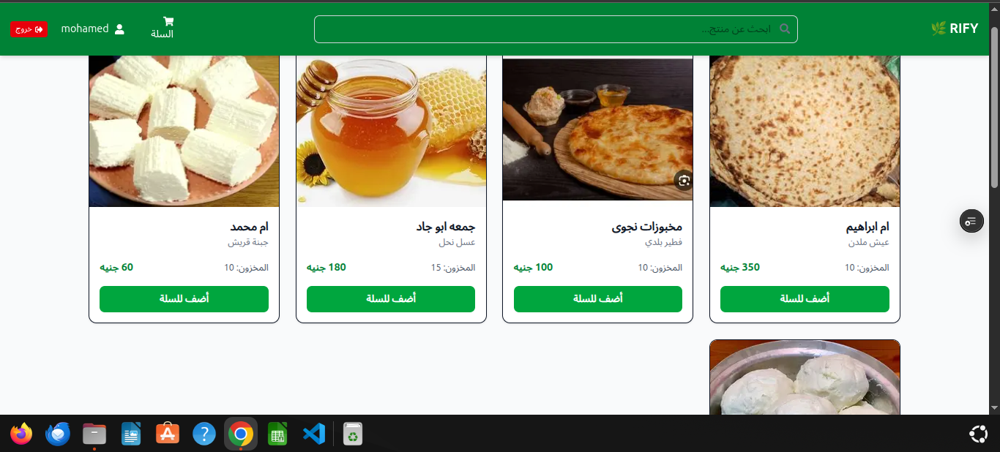
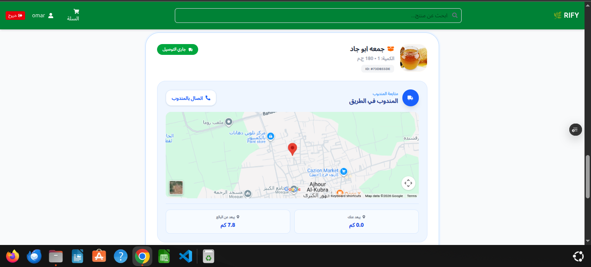
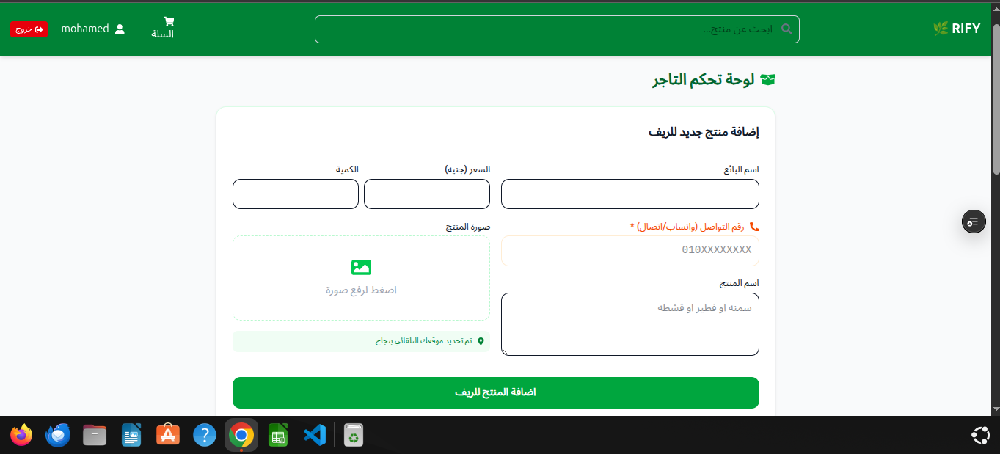
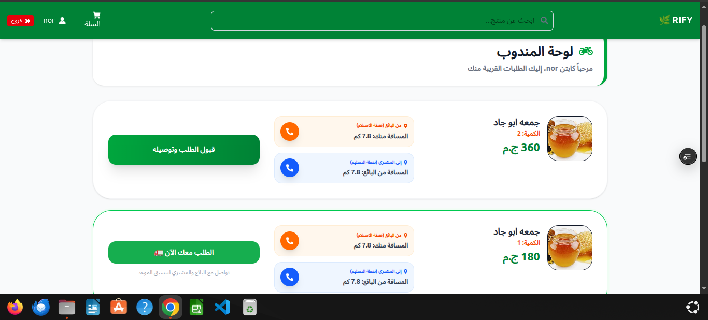

# 🌾 RIFY — Rural Real-Time Delivery Marketplace

> A full-stack real-time system connecting farmers, customers, and delivery drivers in one seamless delivery flow — with integrated online payment.

---

## 🚀 Overview

**RIFY** is a smart rural marketplace that enables the buying and selling of fresh rural products with **real-time delivery tracking**, live GPS updates, and **secure online payment**.

The system connects **3 main roles**:

- 👨‍🌾 Sellers
- 🛒 Customers
- 🚚 Delivery Drivers

From product upload → order creation → **online payment** → driver assignment → live tracking → final delivery… everything runs in real-time.

---

## 🌐 Live Demo

👉 **Try it here:**  
https://rify-beta.vercel.app/

---

## 📸 Screenshots

### 🏠 Home Page



### 🛒 Customer Live Tracking

Real-time driver movement on map after order acceptance  


### 👨‍🌾 Seller Dashboard

Manage products (Add / Edit / Delete)  


### 🚚 Delivery Dashboard

Accept orders and handle real-time delivery flow  


---

## ⚡ Key Features

### 💳 Online Payment System

- Secure card payments via **Paymob**
- 3-step payment flow: Auth → Order Registration → Payment Key
- Webhook verification using **HMAC SHA-512**
- Automatic order status update to `paid` after successful payment
- Dedicated payment success page with auto-redirect to orders

### 🔄 Real-Time System

- Live order updates using Supabase Realtime
- Instant driver location updates on map

### 📍 GPS Tracking

- Live driver movement tracking
- Distance calculation between seller, driver, and customer

### 👨‍🌾 Seller System

- Add / Edit / Delete products
- Upload images and manage stock
- Location-based product data

### 🛒 Customer Experience

- Browse fresh rural products
- Place orders and **pay online securely**
- Track delivery in real-time

### 🚚 Delivery System

- Receive orders after payment confirmation
- Accept / reject delivery requests
- Live navigation support

---

## 🧠 Core Logic

- Real-time events using Supabase
- Haversine Formula for distance calculation
- Multi-role architecture system
- Event-driven delivery flow
- Secure payment flow with Paymob webhook verification

---

## 🛠️ Tech Stack

### Frontend

- Next.js (App Router)
- TypeScript
- Supabase (Auth + DB + Realtime + Storage)
- Tailwind CSS
- Google Maps API

### Backend

- Node.js + Express
- TypeScript
- Paymob Payment Gateway
- Supabase (Service Role)
- Deployed on Railway

---

## 💳 Payment Flow

```
Customer adds products to cart
         ↓
Enters phone number → clicks Pay Now
         ↓
Frontend sends request to Node.js server
         ↓
Server → Paymob: Get Auth Token
         ↓
Server → Paymob: Register Order (with Supabase order ID)
         ↓
Server → Paymob: Get Payment Key
         ↓
Customer redirected to Paymob payment page
         ↓
Customer pays with card
         ↓
Paymob sends Webhook to server (HMAC verified)
         ↓
Server updates order status to "paid" in Supabase
         ↓
Customer redirected to success page
```

---

## 🚀 Getting Started

### Frontend

```bash
git clone https://github.com/omar-sala/Rify.git
cd Rify
npm install
npm run dev
```

### Backend

```bash
cd server
npm install
npm run dev
```

---

## 🔐 Environment Variables

---

## 🌍 Deployment

| Service  | Platform |
| -------- | -------- |
| Frontend | Vercel   |
| Backend  | Railway  |
| Database | Supabase |
| Payment  | Paymob   |
